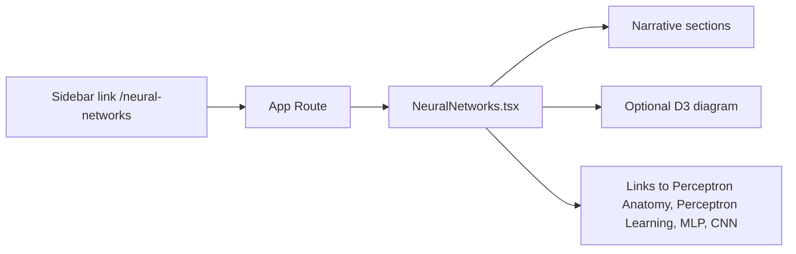

# Neural Networks Module Plan

## Goal

Build the **Neural Networks** module so the sidebar link at `/neural-networks` resolves to a real page. The page will introduce how neurons connect and how learning works via backpropagation, and direct students to existing simulations (Perceptron Anatomy, Perceptron Learning) and future ones (MLP, CNN).

## Scope decision

| Option                                     | Description                                                                                                                                                                                                                                                                          | Effort |
| ------------------------------------------ | ------------------------------------------------------------------------------------------------------------------------------------------------------------------------------------------------------------------------------------------------------------------------------------ | ------ |
| **A. Hub + narrative + diagram**           | One page with scrollable sections (what are NNs, neurons/layers, backprop in plain language), a simple D3 or static diagram of a small network or data flow, and a "Try the simulations" card list linking to Perceptron Anatomy, Perceptron Learning, and placeholders for MLP/CNN. | Low    |
| **B. Hub + narrative + backprop mini-sim** | Same as A, plus a small interactive (e.g. 2-layer toy network, forward pass + one backward step with sliders and gradient display). All in-browser, no new deps.                                                                                                                     | Medium |

**Recommendation:** Start with **Option A**. It matches the existing [HypothesisTesting](ml-simulations/src/pages/HypothesisTesting.tsx) pattern (hub + narrative + D3 diagram + links), ships quickly, and satisfies the sidebar description. Option B can be a follow-up or live in the future "Multi-layer Perceptron Explorer" page.

---

## Architecture

- **Single new page:** `NeuralNetworks.tsx` + `NeuralNetworks.css`.
- **Layout:** Same as other tutorials: `.container`, sections with headings and short paragraphs, optional D3 diagram, then a grid of cards linking to related modules (reuse pattern from HypothesisTesting `testLinks` + cards).
- **Routing:** Add `/neural-networks` in [App.tsx](ml-simulations/src/App.tsx) and import the page and CSS.
- **Sidebar:** In [Sidebar.tsx](ml-simulations/src/components/Sidebar.tsx), change the `neural-networks` item from `status: 'coming-soon'` to `status: 'available'` so the "Coming Soon" badge is removed and the link is active.
- **Content:** No emojis (per [.cursorrules](.cursorrules)). Use design system classes and semantic HTML.

---

## Narrative structure (mental model)

Suggested sections, in order:

1. **What is a neural network?**
  Short intro: networks of connected units (neurons) that process inputs in layers and can learn from data.
2. **Neurons and layers**
  Single neuron: inputs, weights, weighted sum, activation. Layers: input layer, hidden layers, output layer. Reference the Perceptron Anatomy simulator for the single-neuron view.
3. **How learning works: gradients and backpropagation**
  Plain-language explanation: we measure error at the output, then propagate blame backward through the network to update weights (gradient descent). One or two key ideas only; no heavy math. Optional: simple diagram (forward pass vs backward pass).
4. **Try the simulations**
  Card grid with:
  - **Perceptron Anatomy Explorer** (link to `/perceptron-anatomy`) – explore a single neuron.
  - **Perceptron Learning Simulator** (link to `/perceptron-learning`) – see single-layer learning.
  - **Multi-layer Perceptron Explorer** – Coming Soon (no link or link with disabled/coming-soon styling).
  - **Convolutional Neural Network Demo** – Coming Soon (same).

---

## Technical implementation

### 1. Create the page and styles

- **Create:** [ml-simulations/src/pages/NeuralNetworks.tsx](ml-simulations/src/pages/NeuralNetworks.tsx)  
  - React FC, no emojis.
  - Use `Link` from `react-router-dom` for in-app links.
  - Define a small array of module links (similar to `testLinks` in HypothesisTesting): `path`, `title`, `description`, and a `status: 'available' | 'coming-soon'` so the UI can show a badge or disabled state for MLP/CNN.
  - Sections: hero/title, then the four narrative sections above, then the "Try the simulations" grid (cards with title, description, link or "Coming Soon").
  - Optional: one D3 diagram (e.g. small 2-layer network sketch or forward/backward flow). If included, use a `useRef` and `useEffect` to draw in a dedicated SVG container; follow patterns from [PerceptronAnatomy.tsx](ml-simulations/src/pages/PerceptronAnatomy.tsx) or [HypothesisTesting.tsx](ml-simulations/src/pages/HypothesisTesting.tsx).
- **Create:** [ml-simulations/src/pages/NeuralNetworks.css](ml-simulations/src/pages/NeuralNetworks.css)  
  - Reuse design system variables from [design-system.css](ml-simulations/src/styles/design-system.css); add only page-specific classes if needed (e.g. for the diagram or card grid).

### 2. Wire route and sidebar

- **Modify:** [ml-simulations/src/App.tsx](ml-simulations/src/App.tsx)  
  - Add: `import NeuralNetworks from './pages/NeuralNetworks';` and `import './pages/NeuralNetworks.css';`  
  - Add: `<Route path="/neural-networks" element={<NeuralNetworks />} />`
- **Modify:** [ml-simulations/src/components/Sidebar.tsx](ml-simulations/src/components/Sidebar.tsx)  
  - For the item with `id: 'neural-networks'`, change `status: 'coming-soon'` to `status: 'available'` (around line 96). This removes the "Coming Soon" badge and enables the link.

### 3. Docs (optional)

- **Modify:** [ml-simulations/README.md](ml-simulations/README.md)  
  - If "Neural Networks" is listed under "Coming Soon", move it to an "Available" list or remove it from Coming Soon and add a short line under available simulations.

---

## Verification

- Run `npm run build` from `ml-simulations` and fix any TypeScript or lint errors.
- Manually: open `/neural-networks` (with app basename, e.g. `/AI4C/neural-networks`), confirm narrative and links render; click through to Perceptron Anatomy and Perceptron Learning; confirm sidebar no longer shows "Coming Soon" for Neural Networks.

---

## Out of scope (later)

- Full in-browser backprop simulation (Option B): can be a separate task or part of the future Multi-layer Perceptron Explorer.
- New dependencies (e.g. TensorFlow.js): not required for this hub page.

